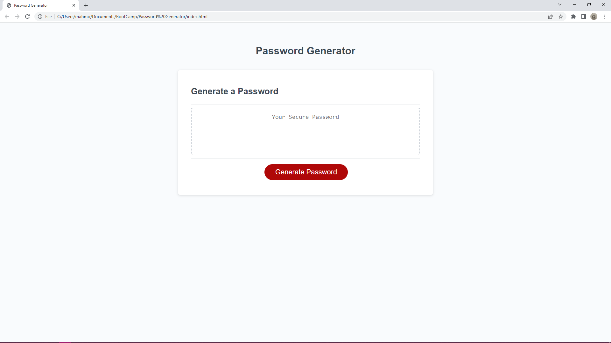
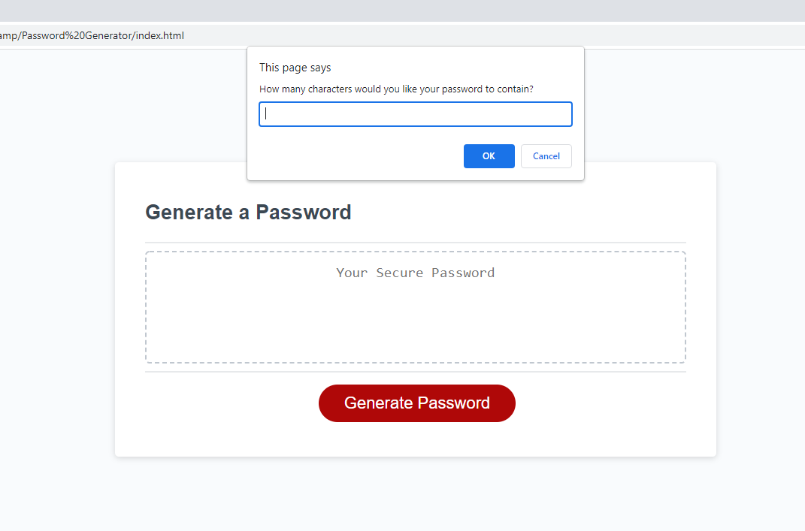
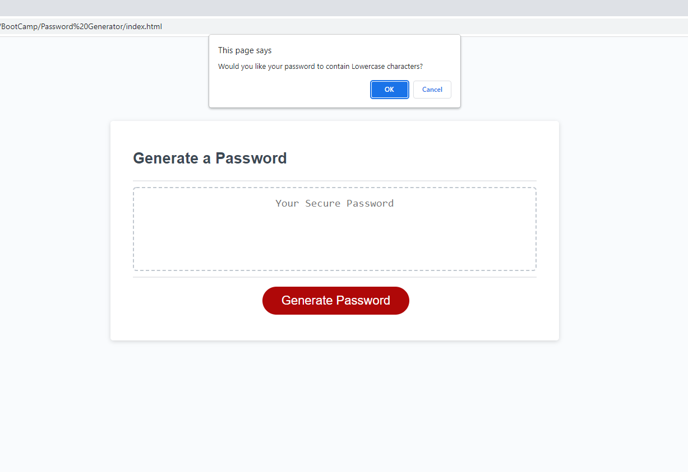
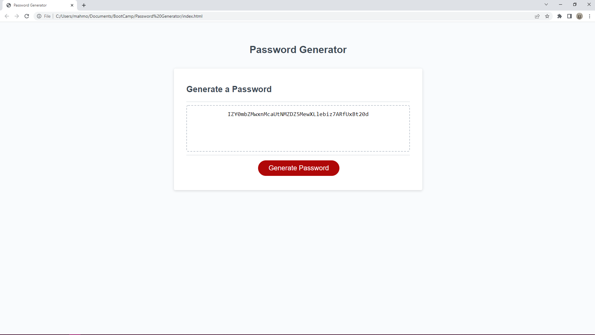

# Password Generator

## Description
I refactored and commented on the css and html files for this password generator page.I had to  adjust the css and script links to fit the new file structure. I added code to make the password generator work on the script file and commented on the different sections of code. This was very challenging and I gained an insight into a couple of things like alternatives/similar functions to .concat and the differences beteen if and while loops.

## Screenshots

Screenshots that include examples of some of the prompts/ confirm tabs.

## Link to Deployed application

https://mahmoodrm.github.io/Wish-I-didnt-need-to-think-of-a-password/